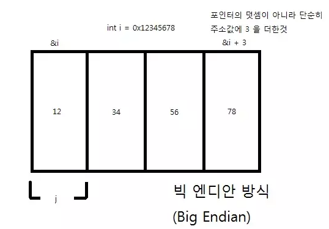
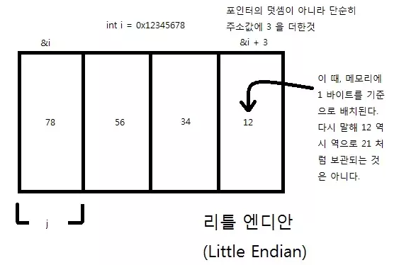
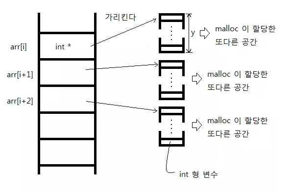

## 배열과 포인터 
* sizeof 와 주소값 연산자(&)와 함께 사용할 때를 제외하면, 배열의 이름은 첫 번째 원소를 가리키는 포인터로 타입 변환된다.
* arr[i] 와 같은 문장은 사실 컴파일러에 의해 *(arr + i) 로 변환된다.

## 배열 포인터 
* 배열을 가르키는 포인터 
```cpp
#include <stdio.h>

int main() {
  int arr[3] = {1, 2, 3};
  int (*parr)[3] = &arr;

  printf("arr[1] : %d \n", arr[1]);
  printf("parr[1] : %d \n", (*parr)[1]);
}
```
```
arr[1] : 2 
parr[1] : 2  
```
* &arr 은 첫 번째 원소를 가르키는 포인터로 형 변환되지 않고, int 형 3개를 가지는 한 덩어리(4바이트 * 3 = 12바이트) 배열을 가르키는 포인터 그 자체로 사용된다
* int (*parr)[3] 의 의미도 (int 크기 * 3) 배열을 가르키는 포인터로 사용하기 위해 만들었다 
* parr 은 12 바이트 크기의 배열의 첫번째 주소를 가르키고 *parr 은 배열의 이름인 arr 과 같은 의미를 갖는다

## 이차원 배열의 주소값 
* 이차원 배열도 메모리상에서는 일차원 배열과 똑같이 선형으로 나열되어 있는 형태이고, 단지 데이터에 접근할 때 인덱스 두개로 표현하는 것 뿐이다 
* int arr[a][b] 라고 정의된 2 차원 배열이 있다면, int arr[b] 짜리 배열이 메모리에 a 번 나열된 것이라 생각하면 된다 
* 이차원 배열의 x행 y열에 있는 arr[x][y] 의 시작 주소값은 arr + 4bx + 4y 가 되기 때문에 arr[x][y] 의 주소값을 정확히 계산하기 위해서는 x, y 뿐만이 아니라 b 가 뭔지 알아야 한다는 점이다
```cpp
#include <stdio.h>
int main() {
  int arr[2][3] = {{1, 2, 3}, {4, 5, 6}};
  int(*parr)[3];  // 괄호를 꼭 붙이세요

  parr = arr;  // parr 이 arr 을 가리키게 한다.

  printf("parr[1][2] : %d , arr[1][2] : %d \n", parr[1][2], arr[1][2]);

  return 0;
}
```
```
parr[1][2] : 6 , arr[1][2] : 6 
```

## 포인터 배열
```cpp
#include <stdio.h>
int main() {
  int *arr[3];
  int a = 1, b = 2, c = 3;
  arr[0] = &a;
  arr[1] = &b;
  arr[2] = &c;

  printf("a : %d, *arr[0] : %d \n", a, *arr[0]);
  printf("b : %d, *arr[1] : %d \n", b, *arr[1]);
  printf("b : %d, *arr[2] : %d \n", c, *arr[2]);

  return 0;
}
```
```
a : 1, *arr[0] : 1 
b : 2, *arr[1] : 2 
b : 3, *arr[2] : 3 
```

## 함수 포인터 
* 프로그래밍 언어를 실행 파일로 컴파일 하기 위해서는 코드가 메모리 상에 올라간다 
* 변수를 가리키는 포인터 처럼 함수 포인터는 메모리 상에 올라간 함수의 시작 주소를 가리키는 역할을 하게 된다 
* 함수 포인터가 함수를 가리키기 위해서는 그 함수의 시작 주소값을 알아야 하는데, 배열과 마찬가지로 함수의 이름이 바로 함수의 시작 주소값을 나타낸다 
```
// 함수 포인터의 정의 
(함수의 리턴형) (*포인터 이름)(첫번째 인자 타입, 두번째 인자 타입,....)
```
```cpp
/* 함수 포인터 */
#include <stdio.h>

int max(int a, int b);
int main() {
  int a, b;
  int (*pmax)(int, int);
  pmax = max;

  scanf("%d %d", &a, &b);
  printf("max(a,b) : %d \n", max(a, b));
  printf("pmax(a,b) : %d \n", pmax(a, b));

  return 0;
}
int max(int a, int b) {
  if (a > b)
    return a;
  else
    return b;

  return 0;
}
```
```
10 15
max(a,b) : 15 
pmax(a,b) : 15 
```

## 문자열의 끝 
* C언어에서는 문자열을 문자배열에 저장한다 
* 문자 배열은 저장하고자 하는 문자 개수에 문자열의 끝을 알리는 종료문자(널)를 넣을 공간이 필요하다 
```cpp
/* 문자열의 시작 */
#include <stdio.h>
int main() {
  char sentence_1[4] = {'K', 'H', 'Y', '\0'};
  char sentence_2[4] = {'K', 'H', 'Y', 0};
  char sentence_3[4] = {'K', 'H', 'Y', (char)NULL};
  char sentence_4[4] = {"KHY"};

  printf("sentence_1 : %s \n", sentence_1);  // %s 를 통해서 문자열을 출력한다.
  printf("sentence_2 : %s \n", sentence_2);
  printf("sentence_3 : %s \n", sentence_3);
  printf("sentence_4 : %s \n", sentence_4);

  return 0;
}
```
```
sentence_1 : KHY
sentence_2 : KHY 
sentence_3 : KHY 
sentence_4 : KHY 
```
* 쌍따옴표("") 로 문자열을 저장할 경우 자동으로 뒤에 널값이 추가된다 

## 입력 버퍼 
* 키보드로 입력한 모든 정보는 일시적으로 stdin(입력 버퍼, 입력 스트림) 에 저장되었다가 나중에 입력이 종료('\n'이 입력)되면 한꺼번에 처리를 하는 방식이다
```cpp
#include <stdio.h>
int main() {
  int num;
  char c;

  printf("숫자를 입력하세요 : ");
  scanf("%d", &num);

  printf("문자를 입력하세요 : ");
  scanf("%c", &c);
  return 0;
}
```
```
숫자를 입력하세요 : 1
문자를 입력하세요 : 
```
* 1을 쓰고 엔터를 치면 stdin에는 "1\n" 이 저장이 된다 
* scanf("%d", &num); 에서 숫자 형식의 데이터인 1을 num 변수에 집어 넣고 stdin 에는 "\n"이 남는다 
* scanf("%c", &c); 에서는 stdin 에 문자가 남아 있다면, 하나의 문자를 가져와 c 에 저장을 한다 
* c에는 '\n' 문자가 저장되어있다 
```cpp
#include <stdio.h>
int main() {
  char str[30];
  int i;

  scanf("%d", &i);
  scanf("%s", str);

  printf("str : %s", str);

  return 0;
}
```
```
1
asdfasfasdf
str : asdfasfasdf
```
* stdin 에는 "1\nasdfasfasdf\n" 이 저장된다
* %s 는 실질적인 데이터가 나오기 전까지 앞에 있는 공백문자('\n', ' ', '\t') 를 무시하고 실질적인 데이터가 입력이 된다면 후에 등장하는 공백문자에서 입력 종료가 된다 

## 입력 버퍼 지우기
```cpp
/* getchar 함수 이용 */
#include <stdio.h>
int main() {
  int num;
  char c;

  printf("숫자를 입력하세요 : ");
  scanf("%d", &num);

  getchar();

  printf("문자를 입력하세요 : ");
  scanf("%c", &c);

  return 0;
}
```
```
숫자를 입력하세요 : 1
문자를 입력하세요 : c
```
* getchar 함수는 stdin 에서 한 문자를 읽어와서 그 값을 리턴하는 함수이다 
* 일반적으로 scanf 에서 %c를 사용하지 않고, %s 형태로 문자열을 입력 받은 뒤에 맨 앞의 한 문자만 취하는 식으로 만든다 

## 문자열 리터럴
* C 언어의 경우 큰 따옴표(") 로 묶인 것들을 문자열 리터럴(string literal) 이라 부른다 
* 프로그램이 실행되서 메모리에 로드되면, 5 가지 종류의 영역(text segment, data segment, bss segment, heap, stack) 이 존재하는데, 텍스트 세그먼트(text segment) 에 프로그램 코드와 상수, 리터럴 등이 여기서 정의된다 
* 문자열 리터럴은 문자열이 저장된 시작 주소값을 담고있다 
* 리터럴이 보관되는 곳은 오직 읽기만 가능한 곳이 되므로 수정할 수 없다 
```cpp
/* 문자열 */
#include <stdio.h>
int main() {
  char str[] = "hello";   // 스택 
  char *pstr = "goodbye"; // 텍스트 세그먼트

  str[1] = 'a';
  // pstr[1] = 'a'; // 에러 

  return 0;
}
```
* char str[] = "hello"; 은 char str[] = {'h', 'e', 'l', 'l', 'o', '\0'}; 으로 단순히 str 이라는 배열에 hello 라는 문자열을 복사한다 
* char str[] = {'h', 'e', 'l', 'l', 'o', '\0'}; 은 텍스트 세그먼트가 아니라 스택(stack)이라는 메모리 수정이 가능한 영역에 정의된다 

## 구조체 
* 다양한 타입의 변수를 묶어서 관리할 수 있다 
```cpp
#include <stdio.h>
struct Human {
  int age;    /* 나이 */
  int height; /* 키 */
  int weight; /* 몸무게 */
};            /* ; 붙이는 것 주의하세요 */
int main() {
  struct Human Khy;

  Khy.age = 99;
  Khy.height = 185;
  Khy.weight = 80;

  printf("Khy 에 대한 정보 \n");
  printf("나이   : %d \n", Khy.age);
  printf("키     : %d \n", Khy.height);
  printf("몸무게 : %d \n", Khy.weight);
  return 0;
}
```
```
Khy 에 대한 정보 
나이   : 99 
키     : 185 
몸무게 : 80 
```
* 구조체 정의부분에서는 변수를 초기화 할 수 없다
* 정의된 구조체는 하나의 타입처럼 사용하고 .을 이용해 각 멤버에 접근할 수 있다 

## 구조체 포인터 
```cpp
/* 구조체 포인터 */
#include <stdio.h>
struct test {
  int a, b;
};
int main() {
  struct test st;
  struct test *ptr;

  ptr = &st;

  (*ptr).a = 1;
  (*ptr).b = 2;

  printf("st 의 a 멤버 : %d \n", st.a);
  printf("st 의 b 멤버 : %d \n", st.b);

  return 0;
}
```
```
st 의 a 멤버 : 1 
st 의 b 멤버 : 2 
```
* 구조체도 하나이 타입으로 정의되기 때문에 구조체 변수를 가르키는 포인터를 만들 수 있다 
* *ptr은 st와 같은 의미로 사용된다
* (*ptr).a = 1; 대신 ptr->a = 1; 처럼 -> 기호를 사용해 멤버에 접근할 수 있다

## 빅 엔디안 (Big Endian), 리틀 엔디안 (Little Endian)
* 컴퓨터에서 메모리에 수를 저장할 때, 우리가 생각하는 방법, 즉 낮은 주소값에 상위 비트를 적는 방식을 빅 엔디안 방식이라고 한다 
*  
* 우리가 생각하는 방법의 정반대로 높은 주소값에 상위 비트를 적는 방식을 리틀 엔디안 이라고 한다 
*  
* 현재 대부분은 x86 프로세서는 리틀 엔디안 방식을 사용하고 있고 일부 컴퓨터에서만 빅 엔디안 방식을 사용하고 있다

## 열거형 (Enum) 
```cpp
/* 열거형의 도입 */
#include <stdio.h>
enum { RED, BLUE, WHITE, BLACK };
int main() {
  int palette = RED;
  switch (palette) {
    case RED:
      printf("palette : RED \n");
      break;
    case BLUE:
      printf("palette : BLUE \n");
      break;

    case WHITE:
      printf("palette : WHITE \n");
      break;
    case BLACK:
      printf("palette : BLACK \n");
      break;
  }
}
```
```
palette : RED 
```
* 컴파일러는 열거형에 나타나 있는 각 원소에 0 부터 차례로 정수값을 매겨준다, RED = 0, BLUE = 1, .. BLACK = 3
* 열거형 에서는 언제나 '정수값'이 매겨진다 
* 컴파일 시에 컴파일러는 RED 는 모두 0 로 바꾸고 BLUE 는 모두 1 로 바꾸는 등 변환 작업이 이루어지기 때문에 실질적으로 RED가 메모리 위에 올라가는 것은 아니다 
```cpp
enum { RED = 3, BLUE, WHITE, BLACK };
```
* RED = 3 부터 해서 BLUE = 4, WHITE = 5, BLACK = 6 이 된다 
```cpp
enum { RED = 3, BLUE, WHITE = 3, BLACK }
```
* BLUE = 4, BLACK = 4

## 정적(static) 변수 
```cpp
#include <stdio.h>

int* function() {
  static int a = 2;
  return &a;
}

int main() {
  int* pa = function();
  printf("%d \n", *pa);
}
```
* static 변수는 자신이 선언된 범위를 벗어나더라도 소멸은 되지 않지만 선언된 범위 안에서만 사용 가능하다
* static int a = 2 라는 문장은 딱 한 번 실행 되어 최초 실행시 딱 한 번 초기화 되며, function 을 실행하지 않더라도 a 라는 정적 변수는 이미 정의되어 있는 상태이다 
* 전역 변수 처럼 정적 변수도 정의시 특별한 값을 지정해 주지 않는 한 0 으로 자동 초기화가 된다 

## 데이터 세그먼트의 구조 
* 프로그램이 실행 될 때 프로그램은 RAM 에 적재된다 
* RAM 위로 올라오는 프로그램의 내용을 크게 나누어서 코드 세그먼트(Code Segment) 와 데이터 세그먼트(Data Segment) 로 분류한다 
* 데이터 세그먼트안에는 Stack 영역 (지역변수), Heap 영역 (프로그래머가 관리하는 메모리 영역), Data 영역 (전역변수, 정적변수), Read-Only-Data (상수와 리터럴), Code 영역 (Code Segment) 로 분류된다 
* Stack 영역과 Data 영역의 메모리 크기는 컴파일 타임에 결정된다 
* Heap 영역의 메모리 크기는 런타임에 결정된다 

## void 형 포인터 
```cpp
/* 임의의 주소값 p 로 부터 byte 만큼 읽은 함수*/
#include <stdio.h>

int read_char(void *p, int byte);

int main() {
  int arr[1] = {0x12345678};

  printf("%x \n", arr[0]);
  read_char(arr, 4);
}

int read_char(void *p, int byte) {
  while (p && byte) {
    printf("%x \n", *(char *)p);
    byte--;

    p = (char *)p + 1;
  } 

  return 0;
}
```
```
12345678 
78 
56 
34 
12 
```
* void 형 포인터 p는 어떠한 타입의 주소값을 받을 수 있지만, 사용할 때는 반드시 받은 주소값의 타입에 맞춰 강제 형변환을 해줘야 한다 
* while (p && byte) 는 p가 NULL 이거나 byte 가 0 이면 반복문을 종료한다는 뜻이다 
* 출력값이 78, 56, 34, 12 로 나오는 이유는 리틀 엔디안 방식으로 메모리를 저장하기 때문이다 

## main 함수의 인자 
```cpp
#include <stdio.h>
int main(int argc, char **argv) {
  printf("받은 인자의 개수 : %d \n", argc);
  printf("이 프로그램의 경로 : %s \n", argv[0]);

  return 0;
}
```
* 각 인자들은 char 형 배열에 저장이 되고, 인자들의 배열의 첫번째 주소값을 모아놓은 배열이 있어, argv 는 인자들의 배열의 첫번째 주소값을 모아놓은 배열의 첫번째 배열을 가르킨다  

## 1 차원 배열 동적  할당 
```cpp
#include <stdio.h>
#include <stdlib.h>

int main(int argc, char **argv) {
  int SizeOfArray;
  int *arr;

  printf("만들고 싶은 배열의 원소의 수 : ");
  scanf("%d", &SizeOfArray);

  arr = (int *)malloc(sizeof(int) * SizeOfArray);
  // int arr[SizeOfArray] 와 동일한 작업을 한 크기의 배열 생성

  free(arr);

  return 0;
}
```
* 런타임에 가변적인 크기로 메모리를 동적으로 할당해주는 함수가 malloc 함수이다 
* malloc 함수를 사용하기 위해서는 stdlib.h 헤더파일을 포함시켜야한다
* malloc(메모리 크기 - byte 단위) -> 할당한 메모리의 시작 주소값을 담고 있는 void 형 포인터를 반환한다 
* Heap 메모리 영역에 메모리를 할당한다 
* Heap 메모리 영역은 오로지 프로그래머가 관리하는 영역이기 때문에 메모리를 할당했다면 free() 함수로 메모리 리소스를 해제해주어야 한다

## 2차원 배열 동적 메모리 할당 (포인터 배열을 이용해서 2 차원 배열 할당하기)
```cpp
/* 2 차원 배열의 동적 할당 */
#include <stdio.h>
#include <stdlib.h>

int main(int argc, char **argv) {
  int i;
  int x, y;
  int **arr;  // 우리는 arr[x][y] 를 만들 것이다.

  printf("arr[x][y] 를 만들 것입니다.\n");
  scanf("%d %d", &x, &y);

  arr = (int **)malloc(sizeof(int *) * x);
  // int* 형의 원소를 x 개 가지는 1 차원 배열 생성

  for (i = 0; i < x; i++) {
    arr[i] = (int *)malloc(sizeof(int) * y);
  }

  printf("생성 완료! \n");

  for (i = 0; i < x; i++) {
    free(arr[i]);
  }
  free(arr);

  return 0;
}
```
```
arr[x][y] 를 만들 것입니다.
3
5
생성 완료! 
```
* arr 은 단순히 int * 형 원소들을 가지는 1 차원 배열이다 
* arr 의 각 원소들은 또 다른 1 차원 배열의 첫번째 주소를 가르킨다 
*  
* 메모리가 연속적이지 못하고 흩어져 있다 

## 2차원 배열 동적 메모리 할당 (진짜 2 차원 배열 할당하기)
```cpp
#include <stdio.h>
#include <stdlib.h>

void add_one(int width, int (*arr)[width], int height) {
  for (int i = 0; i < height; i++) {
    for (int j = 0; j < width; j++) {
      arr[i][j]++;
    }
  }
}

void print_array(int width, int (*arr)[width], int height) {
  for (int i = 0; i < height; i++) {
    for (int j = 0; j < width; j++) {
      printf("%d ", arr[i][j]);
    }
    printf("\n");
  }
}

int main() {
  int width, height;
  printf("배열 행 크기 : ");
  scanf("%d", &width);
  printf("배열 열 크기 : ");
  scanf("%d", &height);

  int(*arr)[width] = (int(*)[width])malloc(height * width * sizeof(int));
  for (int i = 0; i < height; i++) {
    for (int j = 0; j < width; j++) {
      int data;
      scanf("%d", &data);
      arr[i][j] = data;
    }
  }

  printf("----- Array ----- \n");
  print_array(width, arr, height);
  printf("----- Add one ----- \n");
  add_one(width, arr, height);
  print_array(width, arr, height);

  free(arr);
}
```
```
배열 행 크기 : 3
배열 열 크기 : 2
1 2 3 4 5 6
----- Array ----- 
1 2 3 
4 5 6 
----- Add one ----- 
2 3 4 
5 6 7 
```
* 2
